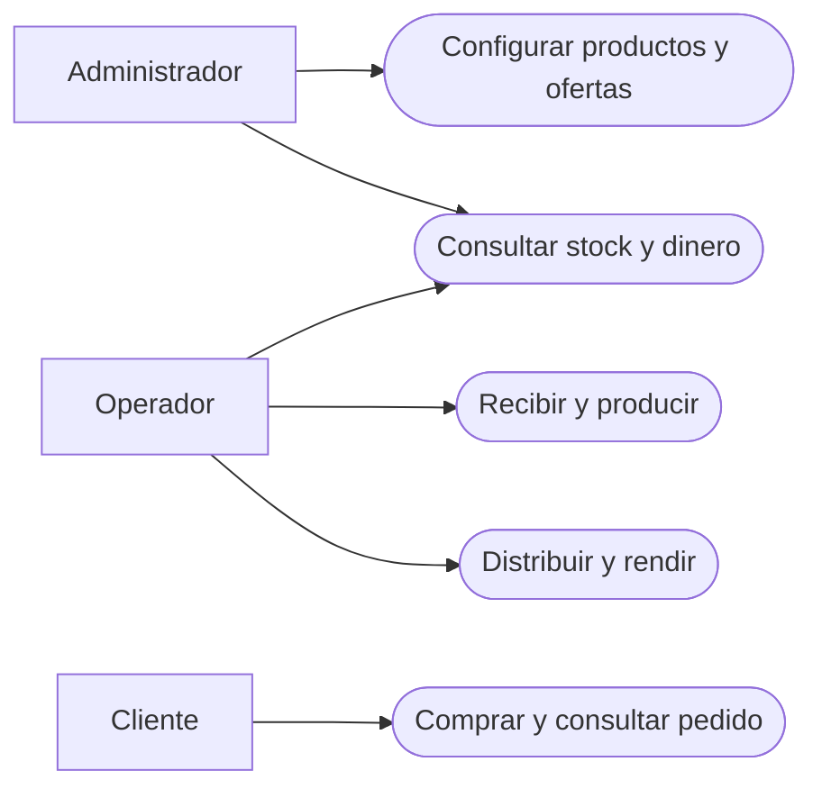
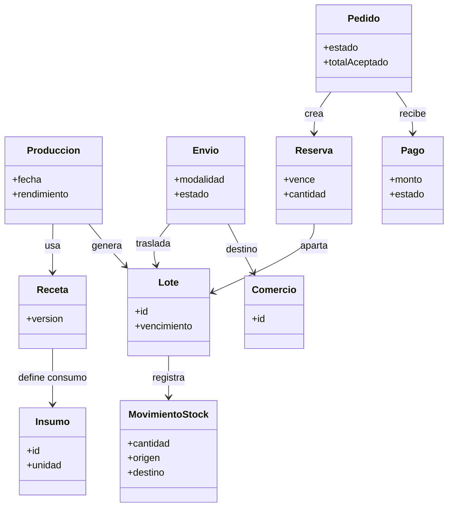
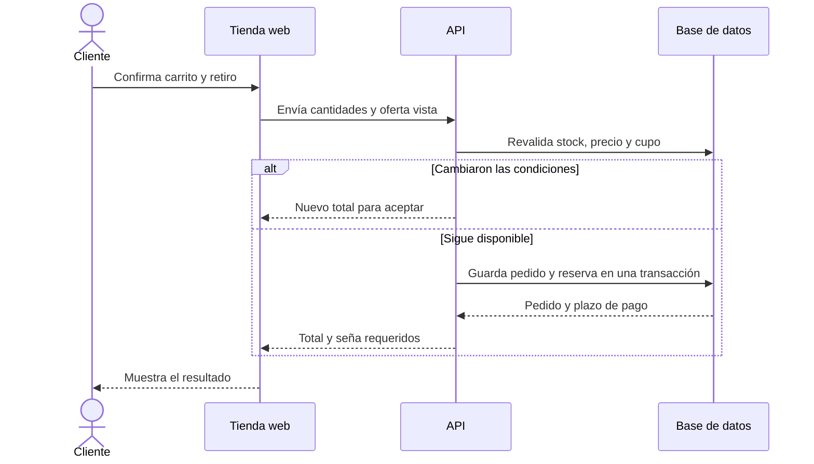
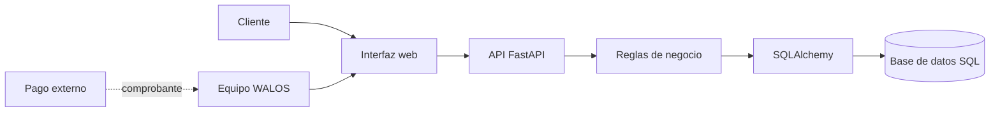

# Documentación del sistema — WALOS

> **Estado:** diseño. La arquitectura y los flujos de esta página son propuestas; todavía no hay API ni interfaz implementadas. Los [requerimientos completos](../docs/requerimientos.md) son la fuente de detalle.

## 1. Descripción, problema y alcance

WALOS necesita conectar compras de insumos, producción por lotes, stock, envíos a comercios y ventas. Hoy parte del control se hace en Excel. La primera versión propuesta combina un panel interno y una tienda para clientes, con carrito, promociones y pedidos con seña. Registra por separado ventas mayoristas y consignación; no incluye un portal para comercios.

## 2. Actores

| Actor | Acción principal |
| --- | --- |
| Administrador | Configura catálogos, ofertas, permisos y dinero. |
| Operador | Registra recepciones, producción, movimientos y entregas autorizadas. |
| Cliente | Compra y consulta sus propios pedidos. |
| Comercio | Recibe mercadería y rinde ventas, devoluciones y mermas a través de WALOS. |

## 3. Requisitos esenciales

| Grupo | Qué debe permitir |
| --- | --- |
| RF01 | Acceso por rol y datos propios del cliente. |
| RF02–RF04 | Gestionar insumos, proveedores, recetas, compras y producción trazable. |
| RF05–RF08 | Conocer stock por lote y ubicación; distribuir, rendir y registrar ventas. |
| RF09–RF12 | Gestionar pedidos, pagos verificados, alertas y resumen exportable. |
| RF13–RF14 | Carrito con precios claros y promociones automáticas autorizadas. |

**Calidad:** interfaz simple en español, permisos por operación, movimientos auditables y operaciones de stock consistentes. Las seis metas verificables están en [requerimientos no funcionales](../docs/requerimientos.md#5-requerimientos-no-funcionales).

## 4. Reglas de negocio

1. Recibir insumos aumenta stock; pagarlos es una operación distinta. Producir descuenta insumos y crea un lote en una sola operación.
2. Consignar mueve unidades al comercio sin convertirlas en venta. Cada envío se concilia como **vendido + devuelto + merma + pendiente**; una devolución requiere revisión.
3. El carrito no aparta stock. Confirmar revalida fecha, precio, unidades aptas y cupo de oferta; entonces crea una reserva temporal. Cobrar no descuenta stock otra vez; entregar registra la salida física.
4. Un 3x2 reserva y entrega tres unidades aunque cobre dos. La seña se calcula sobre el total descontado; las promociones no se acumulan en la propuesta actual.
5. Un lote vencido o en revisión no se ofrece. Las alertas no crean descuentos automáticamente. La vida útil por producto y conservación sigue pendiente de validación.

## 5. Historias y caso de uso

- **Producción:** como operador, quiero registrar insumos usados y unidades obtenidas para rastrear cada lote. **Aceptación:** ambos inventarios cambian juntos o ninguno cambia.
- **Compra:** como cliente, quiero ver el precio final con la oferta válida para decidir antes de pagar. **Aceptación:** el 3x2 desaparece si bajo de tres a dos unidades.

**CU — Confirmar carrito.** Con sesión iniciada y fecha de retiro elegida, el cliente revisa cantidades y total. Al confirmar, el sistema revalida stock, precio y oferta; reserva lote y cupo y devuelve un pedido pendiente de pago con plazo. Si algo cambió, pide nueva aceptación. Un reintento no duplica el pedido ni registra una salida física.

## 6. Diagramas

### Casos de uso

### Modelo de dominio

### Secuencia — confirmar carrito

### Arquitectura propuesta

El equipo verifica el pago externo y registra su estado; la integración directa con Mercado Pago o Cuenta DNI aún debe acordarse. FastAPI, SQLAlchemy y Docker provienen de la consigna académica. Esta arquitectura no representa software ya construido.

## 7. Pruebas mínimas de aceptación

| Acción | Resultado esperado |
| --- | --- |
| Cerrar producción sin insumo suficiente | No cambia ninguno de los dos inventarios. |
| Enviar 10 cajas en consignación | Baja la disponibilidad propia; no nace una venta. |
| Devolver 3 cajas | Quedan en revisión hasta aprobar el reingreso. |
| Confirmar dos carritos por la última unidad | Solo uno obtiene la reserva. |
| Confirmar un 3x2 y pagar la seña | Reserva tres unidades y calcula la seña sobre el total descontado. |

**Pendiente con WALOS:** vida útil, equivalencias y recetas, plazo y porcentaje de seña, gestión de reintegros e integración de pagos. Ver el [listado completo de decisiones](../docs/requerimientos.md#6-decisiones-pendientes-con-walos).
