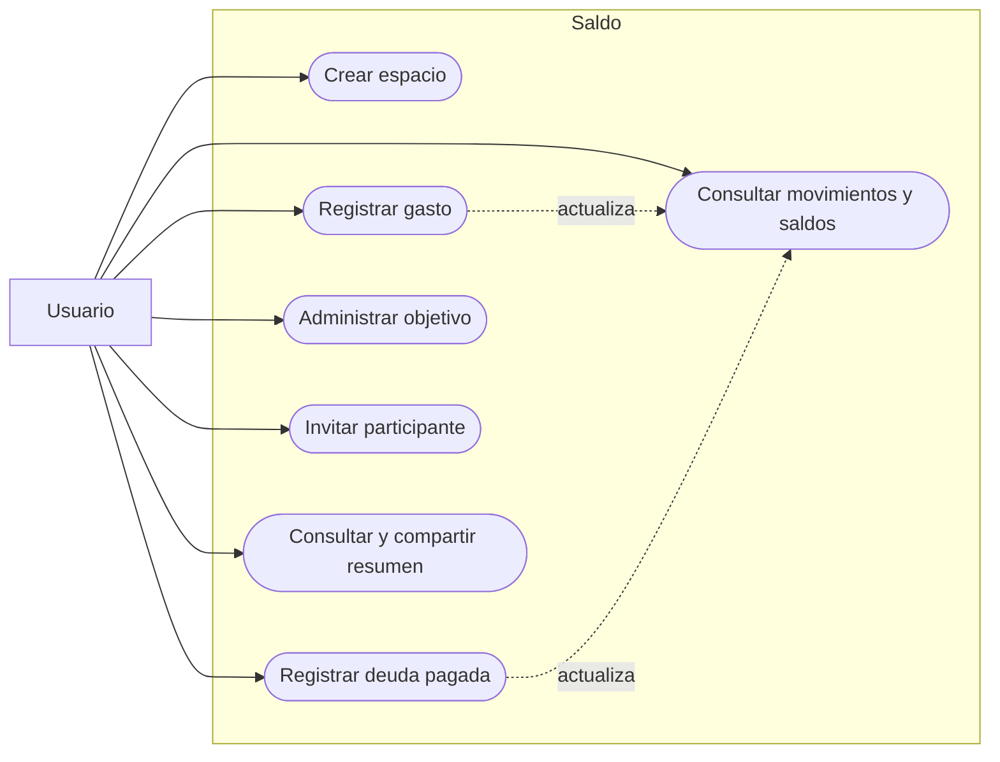
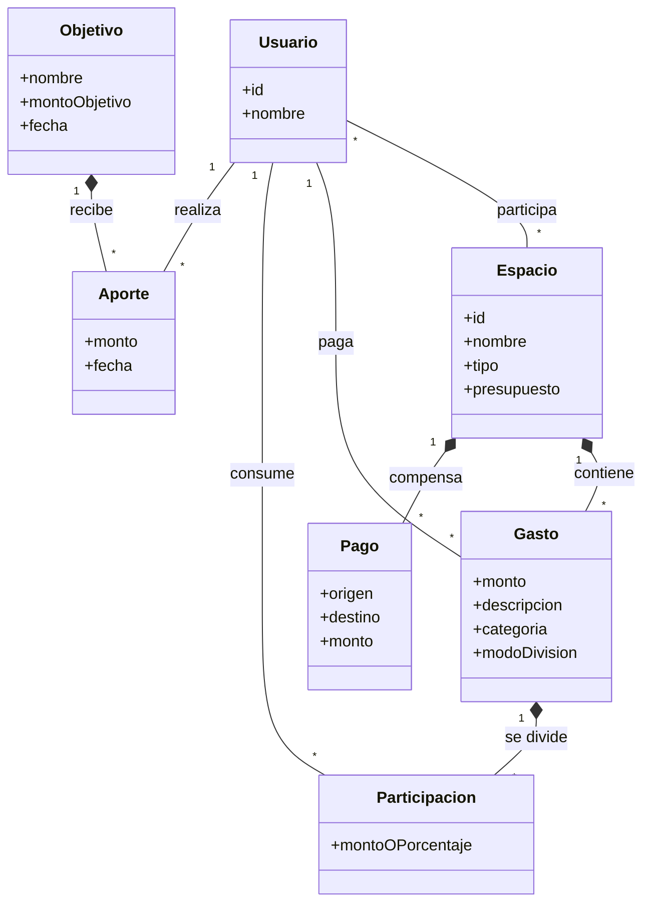
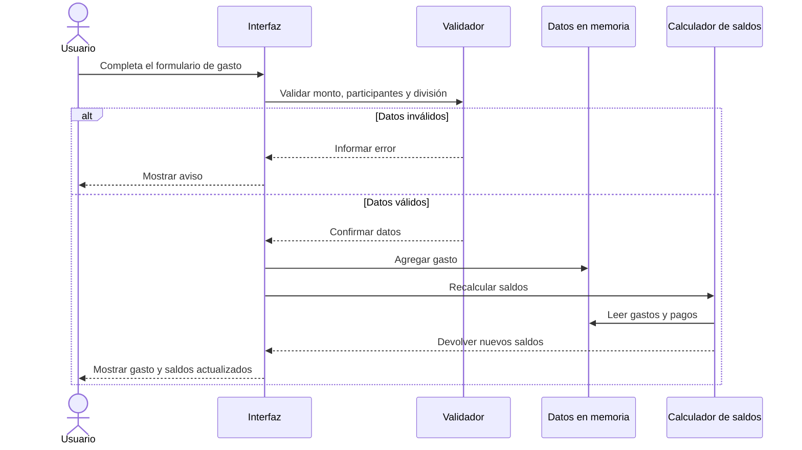
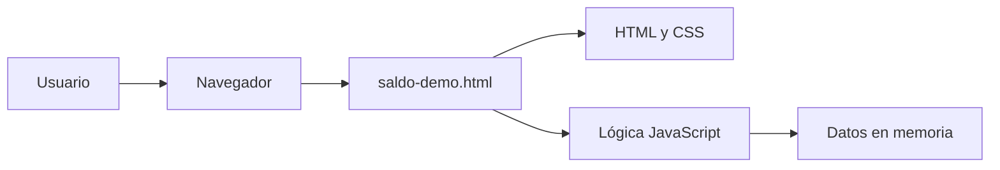

# Documentación del sistema - Saldo

## 1. Descripción

- Su objetivo es centralizar en un único lugar la organización de gastos, la distribución de responsabilidades, las autorizaciones individuales, el cálculo de saldos y la liquidación de pagos.
- El sistema busca resolver gastos planificados, en los que los participantes acuerdan previamente cuánto aportará cada uno y autorizan su participación antes de ejecutar el pago.
- El MVP va a utilizar un servicio de prueba de API de Mercado Pago y una prueba real de descarga de App Store para un testeo real.

## 2. Problema

- Una persona debe disponer temporalmente de dinero para cubrir gastos que en realidad corresponden al grupo (otros usuarios);
- El responsable debe controlar quién pagó, cuánto pagó y quién todavía mantiene una deuda pendiente;
- Una persona puede ser incluida o comprometida en un gasto sin que exista una autorización explícita de su parte;
- Cuando existen muchos participantes pueden producirse errores de comunicación, distribución y seguimiento;
- No siempre existen mecanismos claros para limitar cuánto dinero desea comprometer cada participante.

"Problema a resolver:
La coordinación de un gasto compartido, desde su acuerdo y distribución entre los participantes hasta su pago y posterior liquidación, se encuentra fragmentada entre varias personas, aplicaciones y transferencias independientes."
  
## 3. Objetivos

Permitir que un grupo pueda:

- organizar gastos dentro de espacios;
- definir responsables de pagó y quiénes participan;
- repartir un gasto de diferentes formas;
- conocer cuánto debe o tiene a favor cada persona; Sirve si solo gestionamos???
- registrar pagos y aportes a objetivos comunes.
- Definir alertas/recordatorios de pagos
- Programar/automatizar operaciones. 

## 4. Alcance

### Incluido en el prototipo

- Espacios de tipo evento, permanente (Ej: pagos mensuales o recurrentes) y objetivo (Ej: evento particular de 1 sola vez).
- Presupuesto opcional para eventos. (Ampliar)???
- Combinar distintos eventos en uno solo multiple (Ej: Viaje definir pasajes, hotel, excursiones etc)
- Historial de gastos particular por eventos / Historial de eventos donde participa el usuario.
- Categorías de gastos.
- División en partes iguales, montos fijos o porcentajes.
- Cálculo automático de saldos.
- Registro simulado de pago realizado para ver estado posterior al evento.
- Objetivos de ahorro y aportes.
- Perfil y resumen visual.
- Enlace de invitación simulado.

### Fuera del alcance actual

- Registro e inicio de sesión.
- Persistencia en una base de datos.

- Backend (con python).
- API con FastAPI
- Front (con Javascript/Typescript)
- BBDD (PostgreSQL)
-> Para monetizar plantear un modelo escalable en la nube (GCS o AWS)  

- Invitaciones y usuarios reales.
- Transferencias o medios de pago reales.
- Autorizaciones, límites personales y comprobantes legales.
- Notificaciones, informes exportables y auditoría.

## 5. Actor

### | Actor | Descripción |

#### | Usuario |
Puede:
1) crear espacio de pago;
2) participar en espacios;
3) registrar gastos;
4) consultar gastos;
5) establecer límites;
6) aceptar/rechazar participaciones;
7) Establecer limites de pagos;
8) consultar historial;
9) participar de pagos.
    
#### | Organizador | Es un usuario que crea o administra determinado gasto.
Puede:
1) Crear un gasto compartido
2) Editar un gasto compartido
3) Enviar invitacion a otro usuario
4) Designar responsable de pago (Usuario que computa el pago al proveedor)
  4.1) Asignar un responsable de pago (Por default es el organizador)
  4.2) Designar pago conjunto sin responsable unico.

#### | Participante | Es un usuario que se une a un gasto compartido creado
Puede:
1) consultar participación %
2) aceptar su pago
3) rechazar su pago
4) consultar estado

#### | Responsable del pago | 
Es Usuario que realiza el pago principal cuando se utiliza una modalidad en la que una persona paga y luego es compensada por el resto.

#### | Proveedor de pagos | 
Actor externo encargado de procesar una orden de pago. En la versión académica será simulado

#### | Servicio de notificaciones |
Actor externo opcional encargado de informar nuevas solicitudes, autorizaciones, rechazos, pagos y comprobantes.

Un mismo usuario puede ser organizador, participante y responsable de pago en una operación, y tener roles distintos en otra.
El prototipo usa datos de ejemplo y simula las acciones de todos los participantes desde una misma sesión.

## 6. Reglas de negocio

| Código | Regla |
| --- | --- |
| RN-01 | Todo gasto debe tener un monto mayor que cero. |
| RN-02 | Todo gasto compartido debe poseer al menos dos participantes o dos medios de pagos distintos para un mismo usuario. |
| RN-03 | La suma de las participaciones debe coincidir con el monto total del gasto. |
| RN-04 | Cada participación debe asociarse a un único usuario y a un único gasto. |
| RN-05 | Un usuario solamente puede autorizar su propia participación. |
| RN-06 | El organizador puede proponer participaciones de otros usuarios, pero no autorizarlas en su nombre. |
| RN-07 | Una autorización corresponde a un gasto y monto determinados. |
| RN-08 | Una autorización de un gasto no puede reutilizarse para otro gasto. |
| RN-09 | Si cambia el monto correspondiente a un participante, la autorización anterior queda invalidada. |
| RN-10 | Un participante puede aceptar o rechazar una solicitud pendiente. |
| RN-11 | Un pago planificado no podrá ejecutarse mientras falten autorizaciones obligatorias. |
| RN-12 | Un usuario puede configurar límites personales de gasto. |
| RN-13 | Ningún usuario puede modificar los límites personales de otro usuario, ni excederlos. |
| RN-14 | Antes de autorizar o ejecutar una operación deben verificarse los límites aplicables. |
| RN-15 | Una orden de pago no puede ejecutarse más de una vez. |
| RN-16 | Una orden completada no puede volver a ejecutarse. |
| RN-17 | Toda transacción debe quedar registrada. |
| RN-18 | Un pago exitoso debe generar un comprobante. |
| RN-19 | Si una transacción falla, el sistema debe conservar su estado y resultado anterior a la ejecucion. |
| RN-20 | Los saldos deben recalcularse cuando se registra o liquida una operación que los modifica. |
| RN-21 | Un aporte a un objetivo debe ser mayor que cero. |
| RN-22 | Los gastos y operaciones deben conservar trazabilidad respecto de quién los creó, autorizó o ejecutó. |

## 7. Requisitos funcionales

| Código | Requisito |
| --- | --- |
| RF-01 | El sistema debe permitir registrar y autenticar usuarios. |
| RF-02 | El sistema debe permitir crear espacios/eventos de pago compartidos. |
| RF-03 | El sistema debe permitir incorporar usuarios a un espacio. |
| RF-04 | El sistema debe permitir registrar un gasto con importe, descripción, categoría y participantes. |
| RF-05 | El sistema debe permitir indicar si un gasto ya fue realizado (finalizado) o es planificado. |
| RF-06 | El sistema debe generar un detalle de pago a cada usuario que participo cuando el pago ya fue finalizado. |
| RF-07 | El sistema debe permitir dividir un gasto en partes iguales, montos específicos o porcentajes segun eleccion de usuarios. |
| RF-08 | El sistema debe validar que el reparto coincida con el monto total o el 100 %. |
| RF-09 | El sistema debe permitir crear/editar una participación por cada usuario involucrado. |
| RF-10 | El sistema debe permitir aceptar/rechazar una participación pendiente. |
| RF-11 | El sistema debe permitir agregar/eliminar una participación pendiente. |
| RF-12 | El sistema debe registrar usuario, monto, fecha y estado de cada autorización. |
| RF-13 | El sistema debe invalidar una autorización cuando cambien condiciones relevantes del gasto. |
| RF-14 | El sistema debe verificar los límites de cada usuario antes de autorizar o ejecutar una operación. |
| RF-15 | El sistema debe informar cuando una operación supera un límite configurado. |
| RF-16 | El sistema debe permitir generar una orden de pago. |
| RF-17 | El sistema debe procesar la orden mediante un proveedor de pagos (simulado). |
| RF-18 | El sistema debe registrar el resultado de las transacciones. |
| RF-19 | El sistema debe generar un comprobante cuando una operación finalice correctamente. |
| RF-20 | El sistema debe calcular el saldo individual de cada participante. |
| RF-21 | El sistema debe mantener un historial de gastos y operaciones. |
| RF-22 | El sistema debe permitir consultar gastos por espacio, fecha o categoría. |
| RF-23 | El sistema debe generar informes básicos de gastos. |
| RF-24 | El sistema debe mostrar un resumen de la situación del usuario dentro de sus espacios. |

## 8. Requisitos no funcionales

### 8.1 Seguridad
| Código | Requisito |
| --- | --- |
| RNF-01 | Las operaciones sensibles deben requerir autenticación antes de ejecutarse. |
| RNF-02 | Un usuario solamente debe poder autorizar operaciones correspondientes a sí mismo |
| RNF-03 | Las credenciales deben almacenarse de forma segura. |
| RNF-04 | La aplicación no debe almacenar información real de tarjetas cuando utilice proveedores externos |

### 8.2 Integridad y consistencia
| Código | Requisito |
| --- | --- |
| RNF-05 | El sistema debe mantener consistencia entre gastos, participaciones, autorizaciones, órdenes y transacciones. |
| RNF-06 | El sistema debe impedir pagos duplicados. |
| RNF-07 | Los movimientos deben conservar trazabilidad. |

### 8.3 Usabilidad
| Código | Requisito |
| --- | --- |
| RNF-08 | La interfaz debe adaptarse a pantallas de escritorio y móviles. |
| RNF-09 | El usuario debe poder identificar claramente el monto que está autorizando. |
| RNF-10 | El sistema debe informar claramente cuando una acción implica comprometer dinero. |
| RNF-11 | Los montos deben mostrarse con un formato monetario comprensible para el usuario. |

### 8.4 Rendimiento
| Código | Requisito |
| --- | --- |
| RNF-12 | Los cálculos de saldos y validaciones deben actualizarse inmediatamente después de las acciones relevantes. |
| RNF-13 | Las consultas habituales deben responder en tiempos adecuados para una aplicación interactiva. |

### 8.5 Mantenibilidad y Extensibilidad
| Código | Requisito |
| --- | --- |
| RNF-14 | La lógica de pagos debe permanecer desacoplada del proveedor concreto utilizado. |
| RNF-15 | El sistema debe permitir sustituir el proveedor simulado por una integración real sin modificar la lógica central del dominio. |
| RNF-16 | La arquitectura debe permitir incorporar nuevos tipos de informes, límites o modalidades de pago. |

-------------------
# Diagrama de funcionalidad
USER STORY
"¿Qué quiere conseguir el usuario?"
        │
        ↓
CRITERIOS DE ACEPTACIÓN
"¿Cómo sabemos que está funcionando?"
        │
        ↓
CASO DE USO
"¿Cómo interactúan usuario y sistema para conseguirlo?"
        │
        ↓
PRUEBAS
"¿Cómo comprobamos que realmente funciona?"
-------------------

## 9. User Stories

#### US-01 — Crear espacio
Como **usuario**, quiero **crear un espacio compartido** para **organizar gastos con otras personas**.
#### Criterios de aceptación:
- El espacio debe tener un nombre no vacío.
- El usuario que crea el espacio debe quedar asociado automáticamente como miembro.
- El espacio debe recibir un identificador único (vinculado al creador).
- El espacio debe permitir incorporar otros usuarios posteriormente.

#### US-02 — Invitar participantes
Como **usuario**, quiero **invitar otras personas a un espacio** para **poder compartir gastos con ellas**.
#### Criterios de aceptación:
- El usuario que recibe la invitación debe vincularse al usuario que envia la invitacion previamente.
- La invitación debe identificar el espacio al cual se está invitando, creador, receptor de pago y al usuario invitado.
- El usuario invitado debe poder aceptar o rechazar la invitación.
- Si acepta, debe quedar asociado como miembro del espacio.
- Si rechaza, no debe ser incorporado al espacio.
- Un mismo usuario no debe poder quedar incorporado dos veces al mismo espacio.

#### US-03 — Registrar gasto
Como **usuario**, quiero **registrar un gasto** para **incorporarlo a las cuentas compartidas de un espacio**.
#### Criterios de aceptación:
- El gasto debe pertenecer a un espacio existente.
- El monto debe ser mayor que cero.
- Debe indicarse una descripción del gasto.
- Puede indicarse una categoría.
- Deben existir al menos un participante asociado al gasto.
- Editar el importe implica recrear un nuevo evento de pago debiendo los invitados conectarse nuevamente.

#### US-04 — Distribuir gasto
Como **organizador**, quiero **definir cuánto corresponde aportar a cada participante** para **representar correctamente el acuerdo del grupo**.
#### Criterios de aceptación:
- Debe poder seleccionarse reparto por partes iguales, porcentaje o monto específico.
- En una división igualitaria, el sistema debe calcular automáticamente la participación de cada usuario.
- En una división por porcentajes, la suma debe ser exactamente 100 %.
- En una división por montos específicos, la suma debe coincidir con el monto total del gasto.
- Cada participante debe tener una única participación dentro del gasto. 
- El sistema no debe permitir confirmar una distribución inconsistente/invalida (Ej: Saldo insuficiente en cuenta de un participante).
- Cualquier necesidad de edicion de participacion implica creacion de una nueva orden de pago compartida con los valores nuevos.

#### US-05 — Autorizar participación
Como **participante**, quiero **autorizar únicamente el monto que me corresponde para un gasto específico**, para **que pueda participar sin entregar a otros usuarios control general sobre mi dinero.**
#### Criterios de aceptación:
- El usuario debe poder autorizar únicamente su propia participación.
- Antes de autorizar, el sistema debe mostrar el gasto y el monto comprometido.
- La participación debe encontrarse pendiente de autorización.
- El sistema debe verificar los límites personales antes de aceptar la autorización.
- La autorización debe quedar asociada al usuario, gasto y monto correspondientes.
- Debe registrarse la fecha y el estado de la autorización.
- Debe permitirse elegir al usuario como cubrir la participación que se compromete a pagar. (Opcional)
- Una vez autorizada, la participación debe cambiar de estado.

#### US-06 — Rechazar participación
Como **participante**, quiero **rechazar una solicitud de gasto** para **impedir que se comprometa mi dinero en una operación con la que no estoy de acuerdo.**
#### Criterios de aceptación:
- El usuario solamente debe poder rechazar su propia participación.
- La participación debe encontrarse pendiente de respuesta.
- Al rechazarla, su estado debe cambiar a rechazada.
- El rechazo debe quedar registrado.
- El rechazo no debe autorizar ningún movimiento de dinero.
- Un gasto planificado que requiera esa participación debe quedar anulado.

#### US-07 — Definir límites
Como **usuario**, quiero **establecer límites de gasto** para **evitar comprometer más dinero del que deseo utilizar**.
#### Criterios de aceptación:
- El usuario debe poder definir un límite personal de gastos.
- El límite debe ser un monto válido y no negativo.
- El usuario debe poder modificar o eliminar sus propios límites.
- Ningún usuario debe poder modificar los límites de otro.
- El sistema debe consultar los límites aplicables antes de aceptar una autorización.
- Si una participación supera el límite, el sistema debe advertirlo y no autorizarla automáticamente.
#### Tipos de limites posibles:
- por operación
- por saldo total
- por período

#### US-08 — Ejecutar pago compartido
Como **organizador**, quiero **que el pago pueda ejecutarse cuando se cumplan todas las condiciones requeridas** para **evitar coordinar manualmente las transferencias que conlleva el pago**.
#### Criterios de aceptación:
- El gasto debe ser de planificado.
- Todas las autorizaciones obligatorias deben encontrarse vigentes al efectuarse el pago.
- La suma de las participaciones debe coincidir con el monto del gasto.
- Los límites aplicables deben haber sido verificados.
- El sistema debe generar una única orden de pago o varias según corresponda.
- La orden debe enviarse al proveedor de pagos (simulado).
- El resultado de la operación debe quedar registrado.
- Una misma orden no debe poder ejecutarse dos veces.
- Si la operación es exitosa, debe generarse un comprobante.
- Si falla, debe registrarse el error y la operación no debe figurar como completada.
- Se debe contar con autorización explicita de todos los participantes de la operacion
- Se debe generar un detalle previa aceptación mostrando el resultado de la operación si se ejecutase correctamente

#### US-09 — Consultar estado
Como **participante**, quiero **consultar el estado de un gasto y sus autorizaciones** para **saber si puede ejecutarse o qué acciones siguen pendientes.**
#### Criterios de aceptación:
- El participante debe poder consultar los gastos del espacio al que pertenece.
- El sistema debe mostrar el estado general del gasto.
- Debe mostrar las participaciones asociadas.
- Debe distinguir participaciones pendientes, autorizadas y rechazadas.
- Debe indicar si el gasto está listo para ejecutar.
- Si no está listo, debe indicar qué condición continúa pendiente.
- Si se cambia un estado de autorizado a rechazado/cancelado, debe interrumpierse la operacion completa.
  
#### US-10 — Saldar cuentas
Como **usuario**, quiero **conocer las transferencias necesarias** para **cancelar las deudas del grupo reduciendo la cantidad de operaciones requeridas.**
#### Criterios de aceptación:
- El sistema debe utilizar solamente los saldos aceptados dentro del espacio de pagos.
- Debe identificar usuarios dentro de la sala.
- Debe proponer quién debe transferir, a quién y qué monto.
- Las transferencias propuestas deben permitir llevar todos los saldos a cero una vez completadas.
- No debe proponer transferencias de monto cero o invalido.
- El sistema debe reconocer una transferencia como finalizada al ejecutarse y guardar los detalles de la misma.

#### US-11 — Obtener comprobante
Como **participante**, quiero **obtener un comprobante cuando una operación se complete** para **conservar evidencia de su resultado y poder hacer un control de todos los movimientos realizados**.
#### Criterios de aceptación:
- Solo debe generarse un comprobante para una operación finalizada correctamente.
- El comprobante debe poseer un identificador único.
- Debe identificar la operación correspondiente.
- Debe incluir fecha y monto.
- Debe permitir identificar el gasto asociado a cada usuario.
- Los participantes correspondientes deben poder consultarlo posteriormente.
- Un mismo pago no debe generar comprobantes duplicados por una ejecución repetida.

#### US-12 — Consultar historial
Como **usuario**, quiero **consultar mis gastos y operaciones anteriores** para **controlar el uso de mi dinero.**
#### Criterios de aceptación:
- El usuario debe poder consultar operaciones relacionadas con los espacios a los que pertenece.
- El historial debe mostrar gastos y operaciones anteriores.
- Cada registro debe mostrar como mínimo fecha, concepto, monto y estado.
- Los registros deben presentarse en un orden temporal identificable.
- El usuario no debe poder consultar información privada de espacios de los que no forma parte.
- Las operaciones finalizadas deben mantenerse disponibles para consulta.

#### US-13 — Generar informes
Como **usuario**, quiero **obtener informes por períodos, espacios o categorías** para **analizar mis gastos.**
#### Criterios de aceptación:
- El usuario debe poder seleccionar un período de análisis.
- Debe poder limitar el informe a un espacio determinado.
- Debe poder analizar los gastos por categorías.
- El sistema debe calcular el total correspondiente a los filtros aplicados.
- El informe debe utilizar únicamente gastos a los que el usuario tenga acceso.
- Cuando no existan datos para los filtros seleccionados, el sistema debe informarlo.
- Los resultados deben coincidir con los gastos registrados en el sistema.
- Los resultados deben mostrarse principalmente en formato visual de forma simple dando libertad al usuario sobre como mostrarlos
- Se debe poder descargar/guardar el informe en el formato que desee el usuario dentro de los tipos de archivos comunes. 

#### US-14 — Administrar objetivo
Como **usuario**, quiero **crear objetivos compartidos y registrar aportes** para **controlar el progreso hacia una meta común**.
#### Criterios de aceptación:
- El objetivo debe tener un nombre.
- Debe estar asociado a uno o más usuarios.
- Los usuarios correspondientes deben poder registrar aportes al objetivo.
- Cada aporte debe ser mayor que cero.
- Cada aporte debe registrar usuario, monto y fecha.
- El sistema debe calcular el total acumulado.
- Debe mostrar el progreso respecto del monto objetivo.
- El progreso debe actualizarse después de cada aporte.
- El historial de aportes debe poder consultarse.

## 9. Casos de uso

### CU-01 - Crear espacio de pago/Evento de Pago/Pago compartido/Registrar pago 

- **Actor:** Usuario.
- **Precondición:** 
  El usuario debe estar registrado y autenticado.
- **Flujo principal:**
  El usuario selecciona Crear espacio.
  El sistema solicita los datos del nuevo espacio de pago.
  El usuario ingresa un nombre.
  El usuario confirma la creación.
  El sistema valida los datos.
  El sistema genera un identificador único para el espacio.
  El sistema asocia automáticamente al creador como **miembro creador**.
  El sistema registra el espacio.
  El sistema muestra el nuevo espacio al usuario.
- **Flujo alternativo:**
  - Nombre vacío: el sistema informa el error y no crea el espacio.
  - Datos inválidos: el sistema informa qué datos deben corregirse.
- **Postcondiciones:**
- Existe un nuevo espacio identificado de forma unica al **usuario creador**.
- El creador es miembro del espacio.
- El espacio queda disponible para incorporar participantes vinculados al creador.

### CU-02 - Registrar gasto

### CU-02 - Invitar participante
- **Actor:** Usuario creador.
- **Actor secundario:** Usuario invitado.
- **Precondición:**
- El usuario creador debe estar vinculado al usuario invitado.
- Debe existir un espacio de pago creado.
- El usuario creador debe enviar invitación a otro usuario conocido.
- El usuario invitado debe poder leer las condiciones del evento de pago antes de aceptar unirse.
- **Flujo principal:**
- El usuario creador ingresa al espacio de pago.
- El usuario selecciona Invitar participante.
- El sistema solicita identificar al usuario que desea incorporar.
- El usuario creador selecciona al usuario invitado de una lista de contactos conocidos.
- El sistema verifica que el invitado no pertenezca previamente al espacio.
- El sistema genera una invitación asociada al espacio, al creador y al usuario invitado.
- El usuario invitado recibe y consulta la invitación.
- El usuario invitado selecciona Aceptar.
- El sistema registra la aceptación.
- El sistema incorpora al usuario invitado como miembro del espacio.
- **Flujo alternativo:**
i) El usuario ya pertenece al espacio: el sistema informa la situación y no genera una nueva asociación.
ii) El usuario invitado rechaza la invitación: el sistema registra el rechazo y no lo incorpora al espacio.
iii) La invitación deja de ser válida: el sistema informa que la invitación no puede aceptarse.
iv) Usuario inexistente o no identificado: el sistema informa el error y no genera la invitación.
- **Postcondiciones:**
- Si la invitación es aceptada, el usuario invitado queda asociado al espacio.
- Si la invitación es rechazada, el usuario no queda incorporado.
- No pueden existir dos asociaciones del mismo usuario con el mismo espacio.

### CU-03 - Registrar y distribuir gasto (compartido dentro de un espacio de pago)
- **Actor:** Usuario organizador.
- **Precondición:**
- Debe existir un espacio de pago creado previamente con usuario organizador asociado.
- Los usuarios deben pertenecer al espacio de pago para distribuirse responsabilidades de pago.
- **Flujo principal:**
- El usuario selecciona Registrar gasto.
- El sistema solicita los datos del gasto.
- El usuario ingresa una descripción.
- El usuario ingresa el monto total.
- El usuario puede seleccionar una categoría.
- El usuario selecciona los participantes del gasto.
- El usuario selecciona el método de distribución entre los participante:
    i) partes iguales;
    ii) porcentajes;
    iii) montos específicos.
- El sistema calcula o recibe el monto correspondiente a cada participante.
- El sistema verifica que la suma de las participaciones coincida con el monto total del gasto.
- El sistema muestra un resumen de la distribución propuesta.
- El usuario organizador confirma la distribución.
- El sistema registra la distribución del gasto.
- El sistema crea una participación individual para cada participante.
- Las participaciones quedan pendientes de autorización por cada participante.
- **Flujo alternativo:**
- Monto menor o igual a cero: el sistema informa el error y no permite registrar el gasto.
- Porcentajes distintos de 100 %: el sistema informa que la distribución es inválida.
- Suma de montos distinta del total: el sistema informa la diferencia y no permite confirmar.
- Participación inválida: el sistema informa qué participación debe corregirse.
- Todas las participaciones deben ser mayores a 0.
- Modificación del monto o distribución luego de generar las participaciones: la operación anterior se invalida y se genera una nueva propuesta con los valores actualizados. Debiendo el usuario creador completar las distribuciones de los participantes nuevamente
- **Postcondiciones:**
- Existe un gasto asociado al espacio de pago.
- Cada participante posee una única participación asociada al gasto.
- La suma de las participaciones coincide con el monto total.
- Cada participante recibe un mensaje sobre su responsabilidad de pago sobre el total a pagar.
  
### CU-04 - Autorizar participación
- **Actor:** Participante.
- **Precondición:**
- Debe tener una participacion vinculada al espacio correspondiente en estado pendiente de confirmacion.
- Debe existir un gasto compartido asociado al usuario.
- La participación debe poder rechazarse en cualquier momento, incluso despues de aceptada la participacion,
  pero no al momento de ejecutarse o formalizarse el pago.
- **Flujo principal:**
- El participante consulta la solicitud de participación recibida.
- El sistema muestra la información del gasto.
- El sistema muestra el monto total y el monto correspondiente al participante.
- El participante selecciona Autorizar participación.
- El sistema verifica los límites personales aplicables al usuario.
- El sistema verifica que el gasto y el monto de la participación no cambien hasta que finalice el pago completo.
- El sistema muestra el detalle final de la autorización y lo deja en pendiente de ejecución.
- El sistema registra el usuario, gasto, monto, fecha y estado de la autorización (en proceso de ejecución).
- La participación cambia al estado Autorizada.
- El sistema actualiza el estado general del pago compartido.
- **Flujo alternativo:**
i) *La participación supera un límite personal:* el sistema informa la situación y no autoriza automáticamente la participación.
ii) *El monto o las condiciones del gasto cambiaron:* la solicitud anterior se invalida y debe generarse una nueva autorización desde 0.
iii) *La participación ya fue respondida:* el sistema impide realizar nuevamente la misma autorización.
- **Postcondiciones:**
- La autorización queda vinculada únicamente al usuario, gasto y monto autorizados.
- La participación queda en estado Autorizada - Pendiente de ejecución.
- La autorización no puede utilizarse para otro gasto (Único uso).
- El estado general del pago se actualiza según las autorizaciones existentes.

### CU-05 - Rechazar participación
- **Actor:** Participante.
- **Precondición:**
- Debe existir una participación asociada al usuario.
- La participación debe encontrarse pendiente de respuesta.

- **Flujo principal:**
- El participante consulta la solicitud.
- El sistema muestra el gasto y el monto correspondiente.
- El participante selecciona Rechazar.
- El sistema solicita confirmación.
- El participante confirma el rechazo.
- El sistema registra el rechazo.
- La participación cambia al estado Rechazada.
- El sistema actualiza el estado general del pago compartido.
- El sistema cancela el pago compartido notificando a los demás participantes del motivo de cancelación.
- **Flujo alternativo:**
- El participante cancela la confirmación del rechazo: no se modifica el estado.
- La participación fue rechaza luego de haber sido aceptada previamente y antes de ser confirmada la ejecución por el sistema:
  el sistema cancela el pago compartido notificando a los dems participantes el motivo.
- **Postcondiciones:**
- La participación queda registrada como Rechazada.
- No se autoriza ningún movimiento de dinero correspondiente a ese evento de pago.

### CU-06 - Configurar límites personales
- **Actor: Usuario.**
- **Precondición:**
- El usuario debe estar registrado y autenticado.
- **Flujo principal:**
- El usuario accede a la configuración de límites.
- El sistema muestra los límites personales existentes.
- El usuario selecciona Crear límite o modifica uno existente.
- El usuario selecciona el tipo de límite:
  i) por operación;
  ii) por saldo total comprometido;
  iii) por período.
- El usuario ingresa el monto correspondiente.
- El sistema valida el valor ingresado.
- El usuario confirma la configuración.
- El sistema registra el límite.
- El sistema muestra la configuración actualizada.
- **Flujo alternativo:**
- Monto negativo o inválido: el sistema informa el error y no registra el límite.
- Eliminar límite: el usuario selecciona eliminar, confirma la operación y el sistema elimina el límite.
- **Postcondiciones:**
- Los límites configurados quedan asociados exclusivamente al usuario.
- Los límites quedan disponibles para ser consultados durante futuras autorizaciones y pagos.
- Ningún otro usuario puede modificarlos o acceder a dichos limites.
- En caso de alcanzarse ese limite, se notifica al usuario de forma adicional antes de ejecutar la operacion,
  indicando por cuanto se supera dicho limite o si desea cancelar la operacion.

### CU-07 - Consultar estado del pago compartido
- **Actor:** Participante.
- **Precondición:**
- El usuario debe estar registrado y autenticado.
- El usuario debe pertenecer al espacio de pago que se consulta.
- **Flujo principal:**
- El participante selecciona el pago compartido y consulta el estado actual del pago.
- El sistema muestra la información general de la operación.
- El sistema muestra las participaciones asociadas.
- El sistema indica el estado de cada participación:
  i) pendiente;
  ii) autorizada;
  iii) rechazada;
  iv) cancelada (despues de ser autorizada antes de ejecutarse la oepracion).
  v) en ejecución 
- El sistema muestra el estado general del pago:
  i) Pendiente
  ii) Listo para ejecutarse
  iii) En ejecucion
  iv) Finalizado Correctamente
  v) Finalizado sin ejecutarse (Problemas de alguno de los participantes durante la ejecucion)
  iv) Cancelado  
- El sistema indica si la operación está lista para ejecutarse.
- Si la operación no puede ejecutarse, el sistema muestra las condiciones pendientes.
- **Flujo alternativo:**
- Una autorización previamente válida fue cancelada o invalidada: el sistema actualiza el estado e impide ejecutar la operación.
- La operación fue cancelada: el sistema informa el motivo y su estado final.
- **Postcondiciones:**
- El participante obtiene el estado actualizado del pago en general y de sus participaciones.

### CU-08 - Ejecutar pago compartido
- **Actor:** Usuario organizador.
- **Actor secundario:** Proveedor de pagos simulado.
- **Precondición:**
- El usuario organizador debe estar registrado y autenticado.
- Debe existir un pago compartido planificado.
- Todas las participaciones obligatorias deben estar autorizadas.
- Las autorizaciones deben continuar vigentes.
- La suma de las participaciones debe coincidir con el monto total.
- Los límites personales aplicables deben haber sido verificados.
- La operación no debe haber sido ejecutada previamente.
- **Flujo principal:**
- El organizador selecciona Ejecutar pago.
- El sistema verifica nuevamente las autorizaciones de todos los participantes.
- El sistema verifica los límites personales de cada participante.
- El sistema verifica la consistencia entre el gasto y las participaciones.
- El sistema genera una vista previa de la operación.
- El sistema muestra el monto total, participantes, aportes individuales, destino y movimientos previstos.
- Todos los participantes confirman la ejecución.
- El sistema genera las órdenes de pago necesarias.
- El sistema asigna un identificador único a cada orden.
- El sistema envía las órdenes al proveedor de pagos simulado.
- El proveedor procesa las operaciones.
- El sistema recibe los resultados.
- El sistema registra las transacciones realizadas.
- Si todas las operaciones requeridas fueron exitosas, el pago compartido cambia a estado Completado.
- El sistema genera el comprobante correspondiente.
- El sistema muestra el resultado de la operación.
- **Flujo alternativo:**
- *Falta una autorización:* el sistema impide ejecutar el pago e informa qué participación está pendiente.
- *Una autorización fue rechazada o cancelada:* el sistema interrumpe la operación y la cancela.
- *Se supera un límite personal:* el sistema envia una notificacion a los participantes correspondientes
  y pide una segunda autirzacion para ejecutar las ordenes.
- *La orden ya fue ejecutada: el sistema genera un detalle de la ejecucion y cierra dando por finalizado el evento de pago.
- *El proveedor informa un error:* el sistema registra el error y la operación no figura como completada.
- *Falla una de varias transacciones:* el sistema registra individualmente cuáles operaciones fueron exitosas y cuáles fallaron, manteniendo el pago en un estado no completado, debiendose reparar dicho evento de forma particular entre los participantes.
- **Postcondiciones:**
- Las transacciones ejecutadas quedan registradas.
- Una orden ejecutada no puede ejecutarse nuevamente y el evento creado es dado por finalizado.
- Si el pago finaliza correctamente, queda en estado Completado.
- Si el pago finaliza correctamente, se genera un comprobante.
- Si existe algún fallo, se conserva el estado y detalle de la operación para su control.

## 9. Diagrama de casos de uso

## 10. Diagrama del modelo de dominio

## 11. Diagrama de secuencia - Registrar gasto

## 12. Arquitectura actual

Todo el prototipo está contenido en `saldo-demo.html`. No existe comunicación con servicios externos y no hay persistencia.

## 13. Pruebas mínimas de aceptación

| Prueba | Acción | Resultado esperado |
| --- | --- | --- |
| PA-01 | Crear un evento con nombre y presupuesto. | El espacio aparece y muestra su presupuesto. |
| PA-02 | Registrar un gasto dividido en partes iguales. | El movimiento aparece y los saldos cambian. |
| PA-03 | Registrar una división por montos que no coincide con el total. | El botón de guardado queda deshabilitado y se informa la diferencia. |
| PA-04 | Marcar una transferencia como pagada. | La propuesta y los saldos se recalculan. |
| PA-05 | Aportar un monto positivo a un objetivo. | Aumenta el progreso y aparece el aporte en el historial. |
| PA-06 | Recargar la página. | La demo vuelve a sus datos iniciales porque no posee persistencia. |

## 14. Mejoras futuras

1. Agregar backend, base de datos y autenticación.
2. Implementar invitaciones y permisos reales por usuario.
3. Guardar espacios, gastos, pagos y objetivos.
4. Incorporar autorizaciones antes de comprometer dinero de otra persona.
5. Integrar medios de pago solo después de definir seguridad y auditoría.
