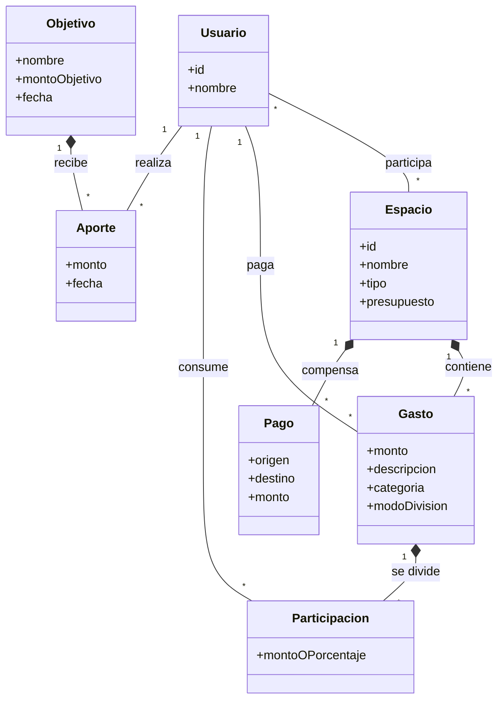
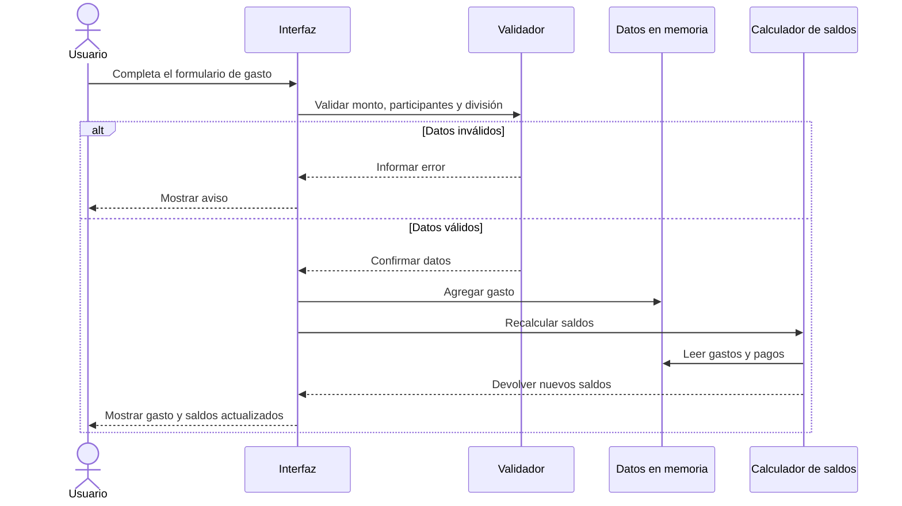
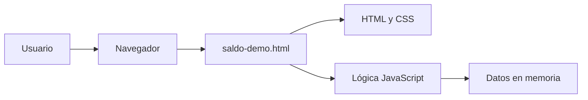

# Documentación del sistema - Saldo

## 1. Descripción

Saldo es un prototipo web para registrar y dividir gastos compartidos. Centraliza los movimientos de un grupo, calcula los saldos individuales y propone las transferencias necesarias para que las cuentas queden equilibradas.

## 2. Problema

Cuando varias personas comparten gastos, una suele pagar y después debe calcular cuánto corresponde a cada integrante. El seguimiento se reparte entre mensajes, anotaciones y transferencias, lo que puede producir errores y discusiones.

Saldo reúne esa información en un mismo lugar y actualiza los saldos automáticamente.

## 3. Objetivo

Permitir que un grupo pueda:

- organizar gastos dentro de espacios;
- definir quién pagó y quiénes participan;
- repartir un gasto de diferentes formas;
- conocer cuánto debe o tiene a favor cada persona;
- registrar pagos y aportes a objetivos comunes.

## 4. Alcance

### Incluido en el prototipo

- Espacios de tipo evento, permanente y objetivo.
- Presupuesto opcional para eventos.
- Registro y listado de gastos.
- Categorías de gastos.
- División en partes iguales, montos fijos o porcentajes.
- Cálculo automático de saldos.
- Propuesta de transferencias para saldar deudas.
- Registro simulado de una deuda como pagada.
- Objetivos de ahorro y aportes.
- Perfil y resumen visual.
- Enlace de invitación simulado.

### Fuera del alcance actual

- Registro e inicio de sesión.
- Persistencia en una base de datos.
- Backend o API.
- Invitaciones y usuarios reales.
- Transferencias o medios de pago reales.
- Autorizaciones, límites personales y comprobantes legales.
- Notificaciones, informes exportables y auditoría.

## 5. Actor

| Actor | Descripción |
| --- | --- |
| Usuario | Persona que crea espacios, registra gastos, consulta saldos y administra objetivos dentro de la demo. |

El prototipo usa datos de ejemplo y simula las acciones de todos los participantes desde una misma sesión.

## 6. Requisitos funcionales

| Código | Requisito |
| --- | --- |
| RF-01 | El sistema debe permitir crear un espacio de evento, permanente u objetivo. |
| RF-02 | El sistema debe permitir registrar un gasto con monto, descripción, categoría, pagador y participantes. |
| RF-03 | El sistema debe permitir dividir un gasto en partes iguales, montos fijos o porcentajes. |
| RF-04 | El sistema debe validar que exista al menos un participante y que el reparto ingresado coincida con el total. |
| RF-05 | El sistema debe mostrar los movimientos y el uso del presupuesto de cada espacio. |
| RF-06 | El sistema debe calcular el saldo de cada integrante según lo pagado y lo consumido. |
| RF-07 | El sistema debe proponer transferencias para cancelar las deudas del grupo. |
| RF-08 | El sistema debe permitir marcar una transferencia propuesta como pagada. |
| RF-09 | El sistema debe permitir registrar aportes a un objetivo de ahorro. |
| RF-10 | El sistema debe mostrar un perfil y un resumen de los espacios del usuario. |
| RF-11 | El sistema debe generar un enlace de invitación simulado. |

## 7. Requisitos no funcionales

| Código | Requisito |
| --- | --- |
| RNF-01 | La demo debe funcionar en un navegador moderno sin instalación. |
| RNF-02 | La interfaz debe adaptarse a pantallas de escritorio y móviles. |
| RNF-03 | Los cálculos deben actualizarse inmediatamente después de cada acción. |
| RNF-04 | Los montos deben mostrarse con formato de moneda de Argentina. |
| RNF-05 | La aplicación debe informar que los datos son temporales y simulados. |

## 8. Casos de uso

### CU-01 - Crear espacio

- **Actor:** Usuario.
- **Precondición:** La demo está abierta.
- **Flujo principal:**
  1. El usuario selecciona `Crear espacio`.
  2. Ingresa un nombre y elige el tipo.
  3. Si es un evento, puede indicar un presupuesto.
  4. Si es un objetivo, indica el monto esperado.
  5. Confirma la creación.
- **Alternativa:** Si falta el nombre o el monto obligatorio del objetivo, el sistema muestra un aviso.
- **Resultado:** El nuevo espacio u objetivo queda disponible durante la sesión.

### CU-02 - Registrar gasto

- **Actor:** Usuario.
- **Precondición:** Existe al menos un espacio con participantes.
- **Flujo principal:**
  1. El usuario selecciona `Registrar gasto`.
  2. Elige espacio, monto, descripción y categoría.
  3. Indica quién pagó.
  4. Elige participantes y forma de división.
  5. Confirma el gasto.
- **Alternativas:** El sistema rechaza montos inválidos, una lista vacía de participantes o un reparto que no complete el monto o el 100 %.
- **Resultado:** El gasto se agrega y los saldos se recalculan.

### CU-03 - Consultar movimientos y saldos

- **Actor:** Usuario.
- **Precondición:** Existe un espacio.
- **Flujo principal:**
  1. El usuario abre `Espacios` para ver gastos y presupuesto.
  2. Abre `Saldos` para consultar cuánto debe o tiene a favor cada integrante.
  3. El sistema muestra una propuesta de transferencias.
- **Resultado:** El usuario conoce el estado del grupo.

### CU-04 - Registrar deuda pagada

- **Actor:** Usuario.
- **Precondición:** El sistema propone al menos una transferencia.
- **Flujo principal:**
  1. El usuario abre `Saldos`.
  2. Selecciona `Pagado` en una transferencia.
  3. El sistema registra el pago simulado y vuelve a calcular los saldos.
- **Resultado:** La deuda queda compensada durante la sesión.

### CU-05 - Administrar objetivo

- **Actor:** Usuario.
- **Precondición:** Existe un objetivo de ahorro.
- **Flujo principal:**
  1. El usuario abre `Objetivo`.
  2. Selecciona `Aportar`.
  3. Ingresa un monto mayor que cero y confirma.
  4. El sistema actualiza el progreso y el historial.
- **Alternativa:** Si el monto no es válido, el sistema muestra un aviso.
- **Resultado:** El aporte queda registrado durante la sesión.

### CU-06 - Invitar participante

- **Actor:** Usuario.
- **Precondición:** La demo está abierta.
- **Flujo principal:**
  1. El usuario selecciona `Invitar gente`.
  2. El sistema genera un enlace de ejemplo.
  3. Intenta copiar el enlace al portapapeles.
- **Alternativa:** Si no se puede copiar, el sistema muestra el enlace en pantalla.
- **Resultado:** El usuario obtiene un enlace simulado; no se crea una invitación real.

### CU-07 - Consultar y compartir resumen

- **Actor:** Usuario.
- **Precondición:** Hay datos de ejemplo en los espacios.
- **Flujo principal:**
  1. El usuario abre `Perfil`.
  2. Consulta cantidad de gastos, saldo a favor y deuda.
  3. Selecciona `Compartir resumen del viaje`.
  4. El sistema muestra una tarjeta visual.
- **Resultado:** Se presenta un resumen simulado; la demo no lo envía a otras aplicaciones.

## 9. Diagrama de casos de uso

## 10. Diagrama del modelo de dominio

## 11. Diagrama de secuencia - Registrar gasto

## 12. Arquitectura actual

Todo el prototipo está contenido en `saldo-demo.html`. No existe comunicación con servicios externos y no hay persistencia.

## 13. Pruebas mínimas de aceptación

| Prueba | Acción | Resultado esperado |
| --- | --- | --- |
| PA-01 | Crear un evento con nombre y presupuesto. | El espacio aparece y muestra su presupuesto. |
| PA-02 | Registrar un gasto dividido en partes iguales. | El movimiento aparece y los saldos cambian. |
| PA-03 | Registrar una división por montos que no coincide con el total. | El botón de guardado queda deshabilitado y se informa la diferencia. |
| PA-04 | Marcar una transferencia como pagada. | La propuesta y los saldos se recalculan. |
| PA-05 | Aportar un monto positivo a un objetivo. | Aumenta el progreso y aparece el aporte en el historial. |
| PA-06 | Recargar la página. | La demo vuelve a sus datos iniciales porque no posee persistencia. |

## 14. Mejoras futuras

1. Agregar backend, base de datos y autenticación.
2. Implementar invitaciones y permisos reales por usuario.
3. Guardar espacios, gastos, pagos y objetivos.
4. Incorporar autorizaciones antes de comprometer dinero de otra persona.
5. Integrar medios de pago solo después de definir seguridad y auditoría.
